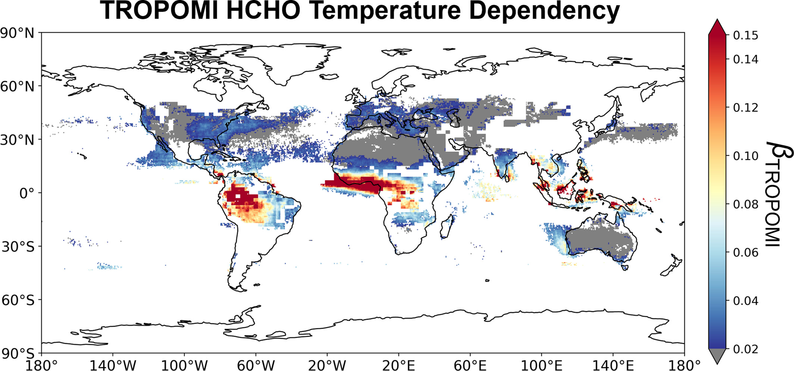

# Global Biogenic HCHO Temperature Dependency

## Research Overview
This study investigates the temperature dependency of global biogenic formaldehyde (HCHO) columns observed from space, combining TROPOMI satellite observations with GEOS-Chem chemical transport model simulations to attribute BVOC emission temperature dependencies.

## Research Motivation
Satellite formaldehyde (HCHO), as an important indicator of biogenic volatile organic compound (BVOC) emissions, can capture the temperature dependency of plant emissions. Can this temperature dependency be extended globally? Does it have sufficient representativeness for BVOCs?

## Why Focus on BVOCs?
- Globally, BVOC emissions account for over 60% of total VOC emissions, and VOCs are important ozone precursors
- BVOCs are diverse in species, difficult to observe, and typically limited to short-term point observations
- HCHO is a reliable tracer for VOC emissions:
  * HCHO is generated in the oxidation pathways of most VOCs
  * HCHO lifetime is similar to isoprene (the most abundant and important BVOC) - approximately several hours
  * Isoprene oxidation has a high yield of HCHO

## Why Use Satellite HCHO?
- Sun-synchronous satellite observations provide daily and global spatiotemporal coverage
- Compensates for the insufficient spatiotemporal coverage of ground-based BVOC measurements

## Why Study Temperature Dependency?
- Temperature is the primary meteorological condition affecting global BVOC emissions
- Under global warming, the impact of increased temperature variability on biogenic emissions cannot be ignored

## Innovation of This Study:
- First investigation of global-scale biogenic HCHO temperature dependency
- Optimized the biogenic BVOC temperature dependency module in GEOS-Chem atmospheric chemistry model using satellite HCHO information

## Original Paper
Click here to read the full paper: [Global Temperature Dependency of Biogenic HCHO Columns Observed From Space: Interpretation of TROPOMI Results Using GEOS-Chem Model](https://doi.org/10.1029/2024JD041784) 